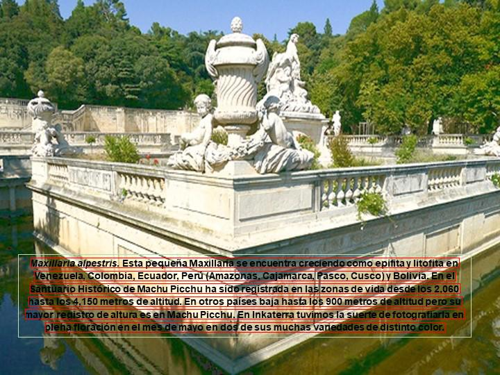
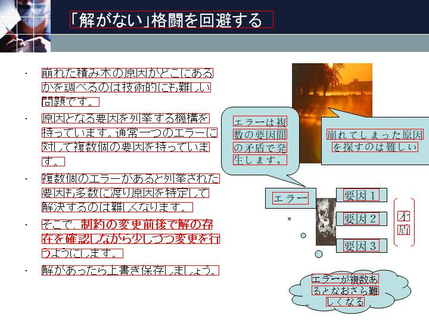
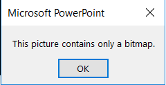

# Generating the data for a language recognition model.

This is a part of the data collection/generation work I am doing at Information Sciences Institute, Marina del Ray.
## What is this repository about?
  This mini engine is dedicated to generating data set for a text detection model. So the data generated from this code is in form of images extracted from the powerpoint slides and labels which are composed of the utf-8 unicoded characters in uxxxx format. The annotations of the corresponding to the image file is written down to a parallely created *annotation.csv* file. Here are some samples generated for Spanish, Korean and Japanese. 
  Having introduced the basic functionality of the code. Now I want to divert the reader attention to a problem. i.e Since this data is to be used to train the text detection model, the embedded images in the power point tend to sneak in text which is impossible to detect with a good text detector. But is that we are trying to build in the first place. Chicken and Egg.
  Chicken and egg break:
 I solved this problem by ungrouping the components in the powerpoint slide and then replacing the image with safe images.
  Safe images?
  The images which were carefully filtered out from a pool of 12.59 million images to NOT contain any text. All images in the power points' slides' were replaced with these 'safe' images. Filtered them using a basic text detection model with a high intolerance for error. 

Check out the following samples

## The complete pipeline of the code looks like:
1. Google custom Search.
2. Win32com package to work with the powerpoint slides using python
3. PIL (pillow) to save the exported image.

## Why is this useful?
This code works with the win32com library.
It is difficult to work with this library:
1. It only works with Windows Machine.
2. The documentation you have to refer to is developed for c# and makes it very frustrating to 'guess' the right method or property.

In addition to this is a cheap way to build a data set for a script recognition system based on Neural Networks. The data collected from this method will atleast allow you to train a model which can recognize the script of the language in a given powerpoint.

## What does this code do:
Here are the tasks this code carries out:
1. Retrieve the links of the powerpoints from the web using Google Custom Search.
2. Download the powerpoints from links in the previous step.
3. Works on these powerpoints to extract the images in 720 x 540 size. 
4. It also generates an annotated file with the coordinates if the text found on the slide.

## Steps to run this code.

1. Getting the powerpoint slides from the web using custom search.

Open up w_web_interactions.py and paste the key in api_key and the search_engine_id. Please follow [follow me to get the key](https://stackoverflow.com/questions/37083058/programmatically-searching-google-in-python-using-custom-search)

I separated the downloading links and downloading the actual powerpoints into two scripts named with prefixed 'd_' just to modularize the code and make the management of the files more easy. Please the d_ prefixed files to get the powerpoints from the web. Just one last thing, the w_web_interactions.py script is where the calls to the web are made and the calls for the downloads are performed. That is where you might want to see if you are interested in looking at the web specific code.

2. Processing the powerpoints to extract the image, annotation labeled data.
Once you have the powerpoint slides in hand you wanna work with them to extract the images and then draw bounding boxes followed by recording the text and the posiition of these bouding boxes. The prefixed i_ scripts do this.
run: python i_from_ppt_extract_bb.py lang_ja. Here lang_ja is the language you are running the code for. This file gives you transcirption files for batches of powerpoints. I choose to work with batches to save intermediate results since the Python-PPT API I am using sometimes behaves different from expected.
 Then you can run the python i_draw_bb.py 0, where the number is the batch count. to generate images with bounding boxes and the labels in annotation_0.csv.

Please forgive for any non clean code you find. I intend to make efforts to further make the code more clean and easier to work with. 
Thank you for reading. Hope you find what you were looking for in here.  
Please feel free to fork and contribute to this repository. There are not many repos battling with win32 client. :P.
  Cheers!!!

# Known issues
1. The extraction of the data from the powerpoints is not entirely automated in the sense this box seldomly appears. [RESOLVED]
 Pressing okay resumes the execution process without problems.
 